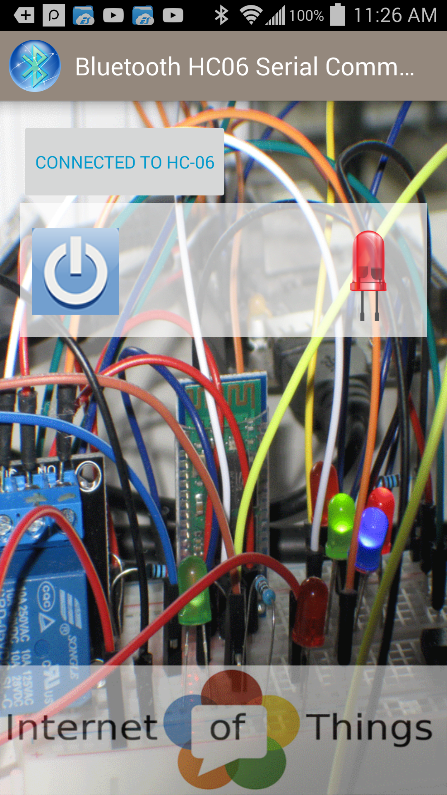
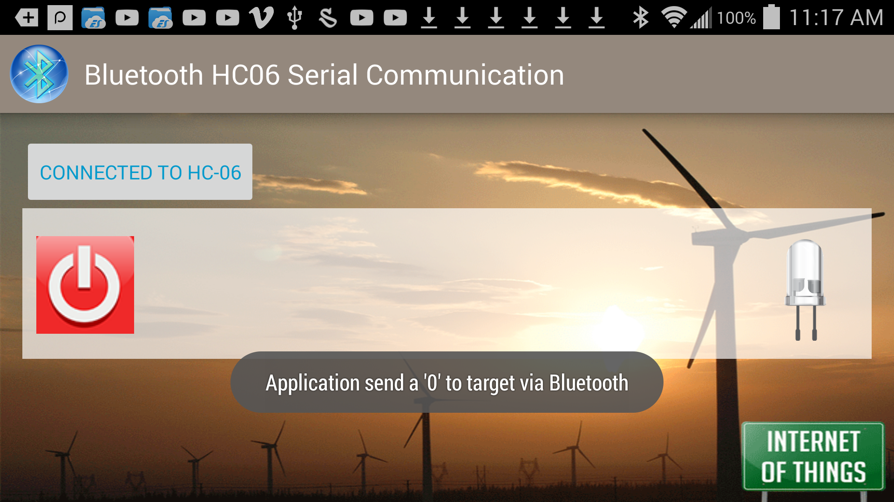
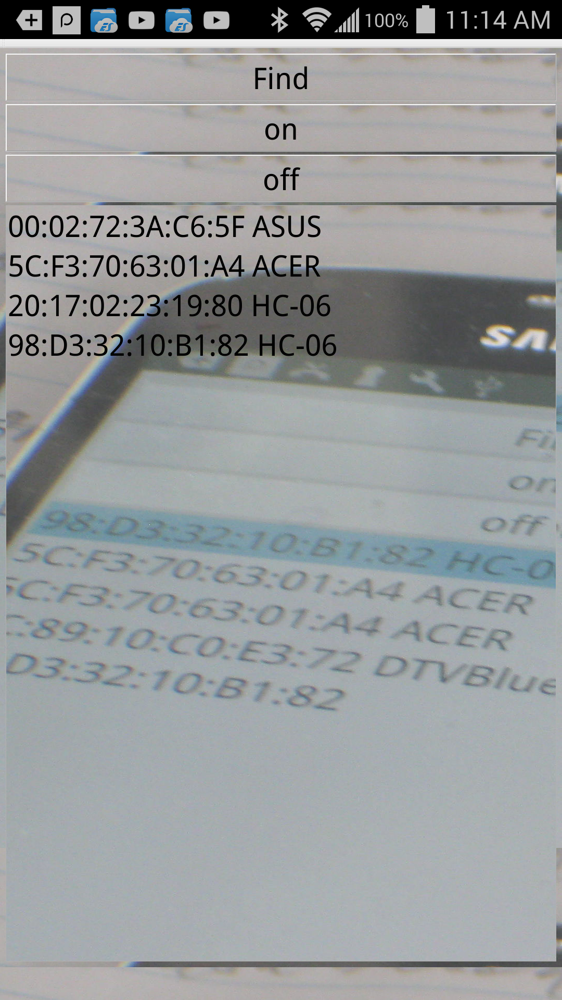
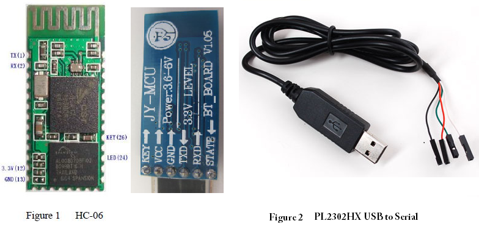

# Bluetooth HC06 serial communication

Basically it replaces the serial/RS-232(UART) cable by going into the air using Bluetooth. It has the same interface: 5v, GND, Tx and Rx. 

C code to commnicate with Android app to turn LED on/off 
Application Java code using on Android Studio 
Application C++ code using Qt creator 

Bluetooth HC06 serial connected to Serial Port /dev/ttyO4 instead of bluetooth default /dev/rfcomm*. Read this serial port to read and write into the hardware. This bluetooth is paired with Android application to send and receive command. Currently only uses one byte to turn on /off devices but it can support hundreds commands to do anything because it is serial data, we can write string of bytes to do different things. 
Android is Bluetooth_HC06.apk is included here, just download Bluetooth_HC06.apk to the phone then install it.  
Source code of this Bluetooth_HC06.apk using Android Studio (Java) https://github.com/thomasalvatran/Aug2017.git  
Source code of Qt C++ Bluetooth.apk using Qt Creator (C++) https://github.com/thomasalvatran/Aug2017_Bluetooth_QT.git  
Setup App and target: http://www.tovantran.com/blog/?p=2945  

Need to pair with with Bluetooth HC06, its default PIN is 1234 but it can be changed pincode in AT command mode (AT+PINxxxx) then connect to it to turn on relay or LEDs that connected to this GPIO address. The block diagram is at 
https://www.dropbox.com/s/vu0vp4hy2oeh4tm/HC-06-Bluetooth-Control-Target.pdf?dl=0"
There are 2 approaches: the simple is using mmap to manipulate GPIO's register via /dev/mem and second approach is sysfs using import/export into /sys/class/gpio. The following code is for mmap approach.

#define GPIO_START_ADDR 0x4804C000  
#define GPIO_OE 0x134 //register for GPIO Output Enable offset 0x134 GPIO_START_ADDRESS  
can be found p. 173 GPIO1 0x4804_C000 of Techincal Reference Manual AM335x ARM Cortex-A8 Microprocessors (MPUs) Technical Reference Manual (Rev. I) 

Also, it can be found from /proc/iomem 
4804c000-4804cfff : /ocp/gpio@4804c000 
4804c000-4804cfff : 4804c000.gpio 

Also, when program is running it can be found /proc/$pid/maps 
b6f32000-b6f34000 rw-s 4804c000 00:05 2292 /dev/mem 

#define GPIO START ADDR 0x4804C000 
#define GPIO_OE 0x134 //register for GPIO Output Enable offset 0x134 

volatile void *gpio_addr = NULL;   //volatile because this I/O device 
int fd = open("/dev/mem", O_RDWR); //file descriptor 

volatile void *gpio_addr = NULL; int fd = open("/dev/mem", O_RDWR); //file descriptor 
gpio_addr = mmap(0, GPIO_SIZE, PROT_READ | PROT_WRITE, MAP_SHARED, fd, GPIO_START_ADDR); //using mmap to map VA to PA  
                                                                        // VA - virtual address = mmap ( PA -physical address) 

//Address of gpio_oe_addr is Base address + Offset. Offset is the same for VA and PA. 
gpio_oe_addr = gpio_addr + GPIO_OE; 

Applicatons screenshots:
<!---->

<table border="0" align="center" width="500">
  <tr>
    <td> </td>
    <td></td>
    <td></td>
  </tr>
</table>

Target is ARM received data from Application via Bluetooth HC06: 
sudo ./gpiotestHC06 
[sudo] password for ubuntu: 
Mapping 4804C000 - 4804DFFF (size: 1FFF) 
GPIO mapped to 0xb6f38000 
GPIO OE mapped to 0xb6f38134 
GPIO SETDATAOUTADDR mapped to 0xb6f38194 
GPIO CLEARDATAOUT mapped to 0xb6f38190 
GPIO1 configuration: E60EFFFF 
Start blinking from Bluetooth H06 
In loop wait for data from ttyO4 to read... 
Read_buff  numBytes = 1 data = 0 
Command not recognizedThe input and output queues have been flushed 
In loop wait for data from ttyO4 to read... 
Read_buff  numBytes = 1 data = 1 
LED ON 
The input and output queues have been flushed 
In loop wait for data from ttyO4 to read.. .
Read_buff  numBytes = 1 data = 0 
LED OFF 

On this HC06 serial bluetooth, there is a RED LED when it is flashed that means it is not paired with any devices. When this RED LED is solid ON it means it has paired with the device. This way we can find the MAC address of HC06 bluetooth based on this LED in case we have many HC06 devices on the network. Its default speed is 9600 baud.

It works well with PL2303HX USB to TTL UART RS-232 connected to COM port(device driver for windows called Prolific USB-to-SerialComm). You need putty or Tera Term to connect with HC06, make sure has the same COM port as in Windows's Device Manager (Windows->control panel->system->device manager).
There is a time out between keystrokes/characters sending to HC06 which result that AT command has no effect since HC06 will not return error the only we know if it works by issue AT cmd AT+NAME to see the name is changed. So we can make it to work by writing all the AT commands in the notepad then just copy from notepad and paste into the terminal the command that we want HC06 to execute. It works great this way.

Enter AT at terminal it should return OK then it works. For example change name of HC-06 to new name enter AT+NAMExyz where xyz is the new name of HC06 bluetooth device. This is standard AT commands. To test the PL2303HX cable by 
connected the TXD and RXD it will echo what type from terminal.

 
<table border=0 width="100" border="0">
  <tr>
    <td>Wire color HC 06</td>
    <td>PL2303HX USB</td>
  </tr>
  <tr>
    <td>red      5v 
    black   GND 
    white   TXD 
    green   RXD 
    (TxD connected Rxd)
    </td>
    <td>red      5v 
    black   GND 
    green   RXD 
    white   TXD 
    (RxD connected TxD)
    </td>
  </tr>
</table>

Total cost: $3.00 (HC06) and $2.00(USB to Serial) = $5.00 (order from ebay.com or amazon.com)
